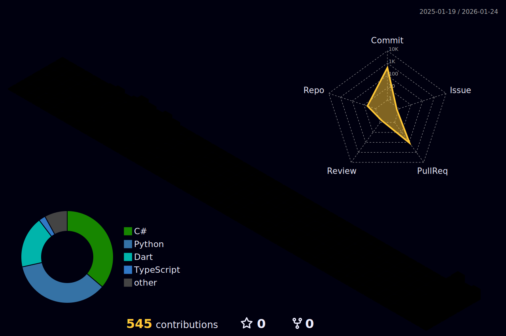

  

# 👨‍💻 Tama - Zero Light

  
  

**Backend Developer** From **Việt Nam** 🇻🇳.

  
  
  

---

    

---

## 🏆GitHub Trophies

---
### ⚡ Tech Stack

  <table border="0" style="border-collapse: collapse; border: none;">
    <tr align="center">
      <th width="25%">Backend Core (.NET)</th>
      <th width="25%">Modern Fullstack (JS/TS)</th>
      <th width="25%">Mobile & Tools</th>
      <th width="25%">Database & Cloud</th>
    </tr>
    <tr align="center">
      <td>
        
         <b>C# / .NET / SQL Server</b>
      </td>
      <td>
        
         <b>Next.js 16 / NestJS 11 / GraphQL</b>
      </td>
      <td>
        
         <b>Flutter / Dart / Electron with Next.js</b>
      </td>
      <td>
        
         <b>PostgreSQL / Azure / Cloudinary / Firebase</b>
      </td>
    </tr>
  </table>

---

### 🚀 Featured Projects

#### 🎓 [Full Course - eLearning Platform](https://github.com/Tama0026/Full_Course)
> **AI-Powered Fullstack Learning Management System**
- **🛠 Tech Stack:**    
- **💡 Highlights:** Features AI-generated content & assessments (Gemini), anti-cheat exams, real-time gamification, and secure BFF JWT authentication.

#### 🚛 [MTCS - Logistics System](https://github.com/HienMinh56/MTCS-BE)
> **Capstone Project - Driver & Delivery Management**
- **🛠 Tech Stack:**    
- **🏆 Achievements:** Built with **3-Layer Architecture**, integrated Real-time tracking for drivers.

#### 🍔 [NomNom App](https://github.com/HienMinh56/NomNom-BE)
> **Food Ordering for Students**
- **🛠 Tech Stack:**   
- **🏗 Architecture:** Implemented Repository & Unit of Work patterns.

---

### 📊 GitHub Stats

  

  

  

   

  

<picture>
  <source media="(prefers-color-scheme: dark)" srcset="https://raw.githubusercontent.com/Tama0026/Tama0026/output/github-contribution-grid-snake-dark.svg">
  <source media="(prefers-color-scheme: light)" srcset="https://raw.githubusercontent.com/Tama0026/Tama0026/output/github-contribution-grid-snake.svg">
  
</picture>

   
  

  

